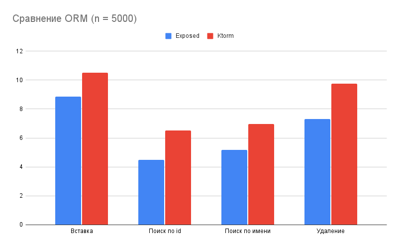
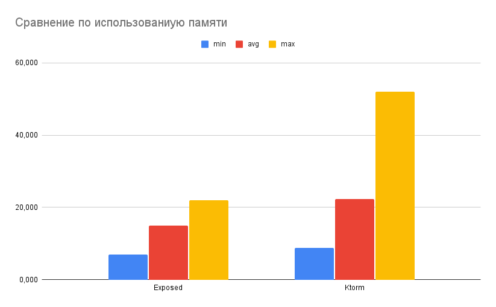
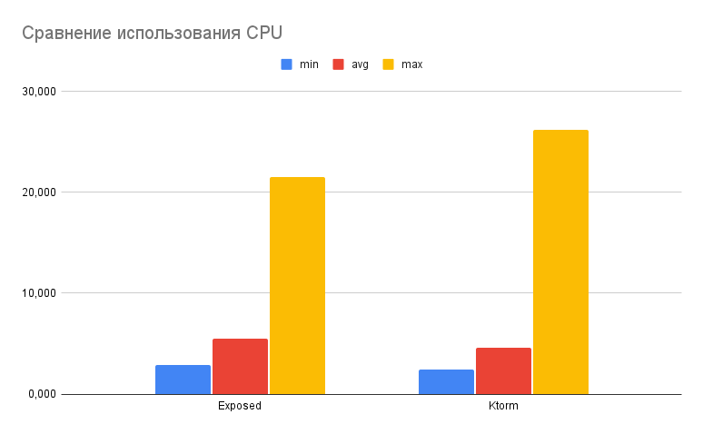

# Сравнение ORM (n = 5000)

## Сравнение по времени обработки запросов

| ORM      | Вставка  | 	Поиск по id | 	Поиск по имени | 	Удаление |
|----------|----------|--------------|-----------------|-----------|
| Exposed	 | 8,8622   | 	4,4838      | 	5,1712         | 	7,3074   |
| Ktorm    | 	10,5006 | 	6,5062	     | 6,9642          | 	9,7406   |

Видно, что exposed работает во всех случаях лучше

## Сравнение по использованию памяти (мб)

| ORM      | min    | 	avg     | 	max    |
|----------|--------|----------|---------|
| Exposed	 | 6,898  | 	14,995  | 	21,914 |
| Ktorm    | 	8,714 | 	22,253	 | 52,058  |

Видно, что exposed использует меньше памяти

## Сравнение по использованию cpu (%)

| ORM      | min    | 	avg    | 	max    |
|----------|--------|---------|---------|
| Exposed	 | 2,930  | 	5,517  | 	21,560 |
| Ktorm    | 	2,470 | 	4,574	 | 26,240  |

Видно, что ktorm меньше загружает cpu, но в пиках загрузка может быть больше

## Вывод

Ktorm серьёзно проигрывает exposed в скорости работы и по использованию памяти, но чуть меньше загружает cpu